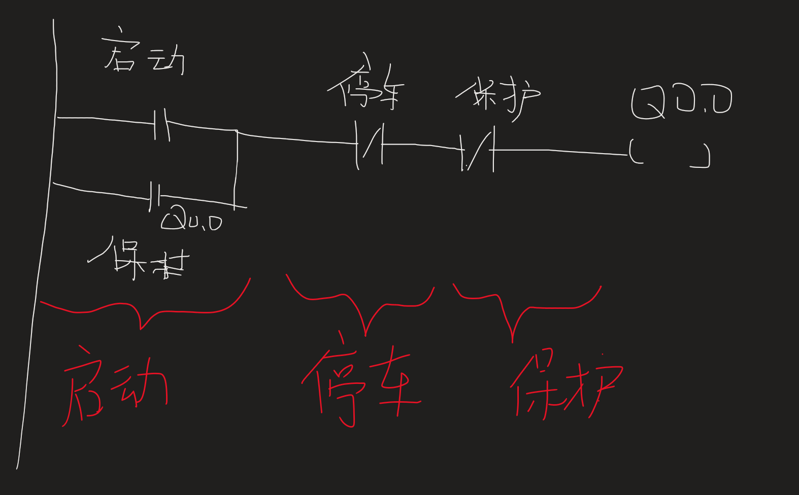

# PLC编程

1. **梯形图（LD/Ladder Logic）** ：最常用且直观，类似继电器电路，易于电气工程师掌握。  
2. **功能块图（FBD）** ：通过图形化模块表示逻辑，适合复杂功能实现，直观性强。  
3. **结构化文本（ST）** ：类似高级语言（如C或Pascal），适用于复杂运算和算法设计。  
4. **顺序功能流程图（SFC）** ：基于状态转换，适合描述并发或大型程序的流程。  
5. **指令表（IL）** ：类似汇编语言，使用助记符，适合简单指令或手持编程器操作。  

## 1 梯形图(Ladder Diagram)编程

众所周知,PLC主要完成对对象的控制
因此
- 对象:电气元件(触点)
- 状态(开关)

### 1.1 基本定义  
- 梯形图由两条垂直的“电源轨”（Power Rails）和多个水平“梯级”（Rungs）构成，形似梯子，每个梯级代表一个独立的逻辑操作。  
- 语言特点：图形化、顺序执行（从上到下、从左到右）、适用于布尔逻辑和简单流程控制。  

### 1.2 关键元素  
- **触点（Contacts）** ：代表输入信号状态，分为常开触点（NO）和常闭触点（NC），对应传感器、按钮等物理输入。  
- **线圈（Coils）** ：代表输出动作，如继电器、电机启动器，包括普通线圈、锁存线圈（Set/Reset）等。  
- **功能块（Function Blocks）** ：用于复杂操作，如定时器（TON/TOF）、计数器（CTU/CTD）、算术运算等。  

### 1.3 输入/输出和特殊存储器
- **输入（I）**：代表外部输入信号，如传感器、开关等。通常用I0.0、I0.1等表示。
- **输出（Q）**：代表外部输出信号，如继电器、指示灯等。通常用Q0.0、Q0.1等表示。
- **特殊存储器（SM）**：用于存储PLC内部状态和控制信息，如系统标志位、计时器状态等。通常用SM0.0、SM0.1等表示。

## 2 梯形图符号与指令详解  
### 2.1 位逻辑指令  
- **常开触点（NO Contact）** ：当输入为“1”时导通，符号为“| |”。  
- **常闭触点（NC Contact）** ：当输入为“0”时导通，符号为“|/|”。  
- **上升沿/下降沿检测**：用于捕捉信号变化瞬间，符号为“P”（Positive Transition）和“N”（Negative Transition）。  

### 2.2 输出指令  
- **普通线圈（Output Coil）** ：根据左侧逻辑结果直接控制输出状态。  
- **锁存线圈（Latch/Unlatch）** ：通过置位（Set）和复位（Reset）指令保持输出状态，直到被明确改变。  

### 2.3 功能块指令  
- **定时器（Timer）**：  
  - TON（通电延时）：输入激活后，延时输出。  
  - TOF（断电延时）：输入断开后，延时关闭。  
- **计数器（Counter）**：  
  - CTU（加计数器）：累加输入脉冲，达到预设值后触发输出。

## 3 编程规范

按照启动(导通)/保持 ,停止 ,保护的结构来。

1. 明确I/O.点
2. 确定I/O.的逻辑关系

- 输出:KM Q0.0
- 输入:
  - SB1启动按钮 $\text{I}0.0$
  - SB2停机按钮 $\text{I}0.1$
  - FR保护      $\text{I}0.1$

