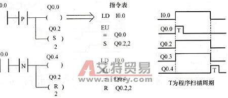
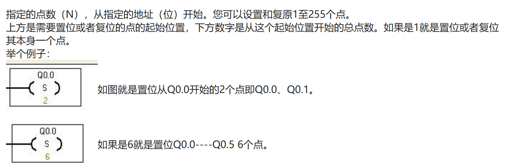
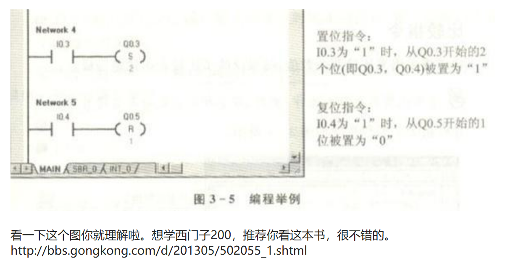
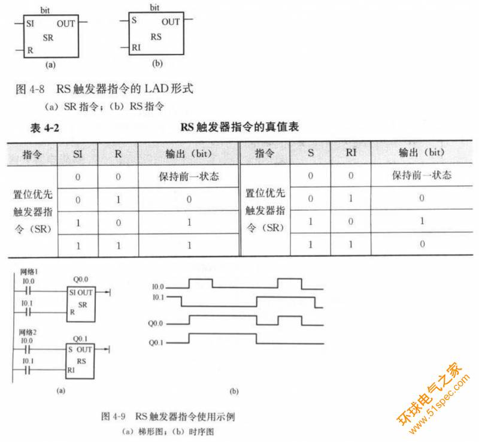
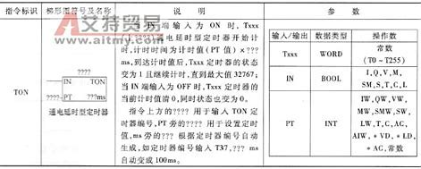
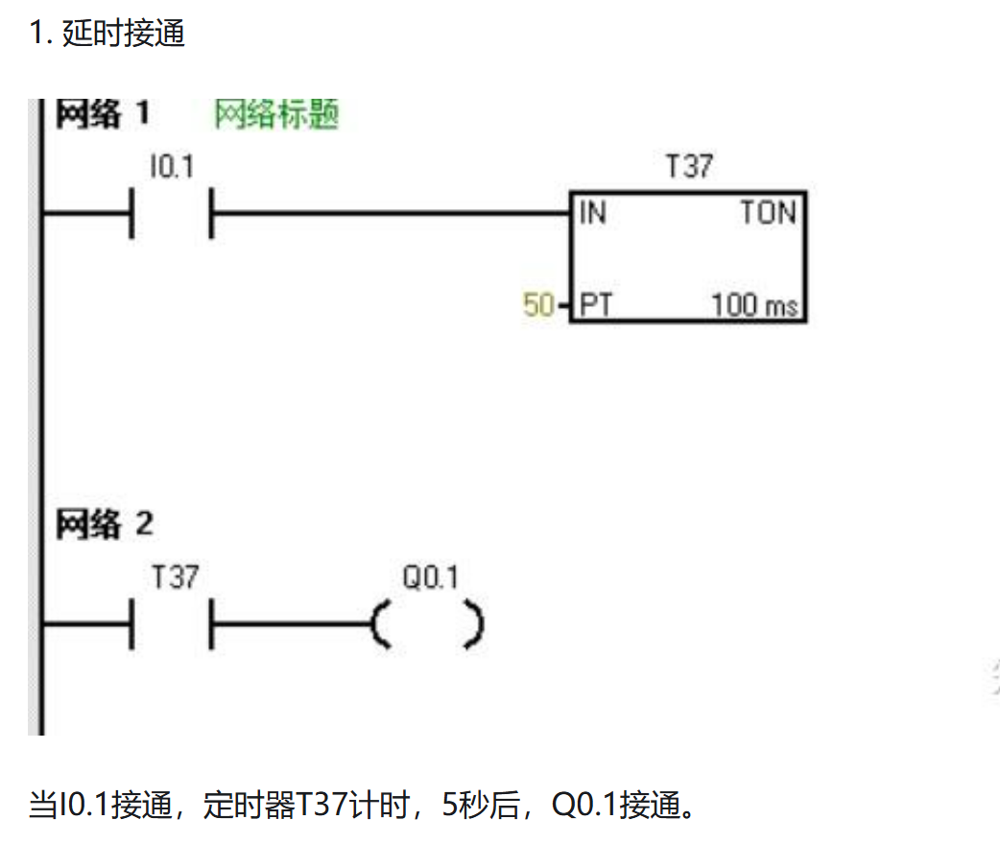
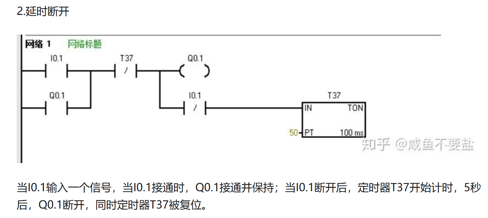
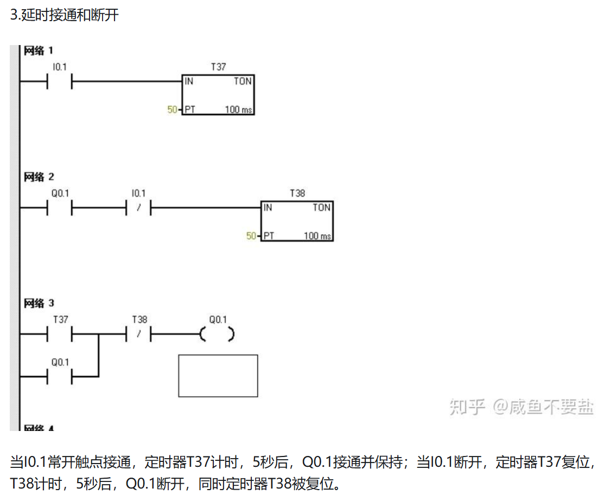

# 指令

1. -||- 常开接点(地址)
2. -|/|- 常闭接点(地址)
3. XOR 位异或
4. -|NOT|- 信号流反向
5. -( ) 输出线圈
6. -(#)- 中间输出
7. -(R) 线圈复位
8. -(S) 线圈置位
9. RS 复位置位触发器
10. RS 置位复位触发器
11. -(N)- RLO下降沿检测
12. -(P)- PLO上升沿检测
13. -(SAVE) 将RLO存入BR存储器
14. MEG 地址下降沿检测
15. POS 地址上升沿检测

## 1 SR指令

### 1.1 SR

PLC S/R指令格式及功能

1. SET:
2. RESET:

### 1.2 RS触发器

| 触发器类型 | 功能     |
| ---------- | -------- |
| RS触发器   | 复位优先 |
| SR触发器   | 置位优先 |

#### RS触发器的真值表

| S   | R   | Q (输出) |
| --- | --- | -------- |
| 0   | 0   | 保持     |
| 0   | 1   | 0        |
| 1   | 0   | 1        |
| 1   | 1   | 0        |

#### SR触发器的真值表

| S   | R   | Q (输出) |
| --- | --- | -------- |
| 0   | 0   | 保持     |
| 0   | 1   | 0        |
| 1   | 0   | 1        |
| 1   | 1   | 1        |

## 2 正负跳变指令

### 2.1 上升沿检测指令 (P)

上升沿检测指令用于检测信号从低电平变为高电平的瞬间。当输入信号从0变为1时，输出一个脉冲信号。

### 2.2 下降沿检测指令 (N)

下降沿检测指令用于检测信号从高电平变为低电平的瞬间。当输入信号从1变为0时，输出一个脉冲信号。

### 2.3 应用实例

上升沿和下降沿检测指令常用于需要对信号变化进行响应的场合，例如计数器的触发、脉冲信号的捕捉等.

## 3 定时器指令及应用(Timer)

| 工作方式 | 时基(分辨率)/ms | 最大定时范围/s | 定时器号             |
| -------- | --------------- | -------------- | -------------------- |
| TONR     | 1               | 32.767         | T0, T64              |
|          | 10              | 327.67         | T1～T4, T65～T68     |
|          | 100             | 3276.7         | T5～T31, T69～T95    |
| TON/TOF  | 1               | 32.767         | T32, T96             |
|          | 10              | 327.67         | T33～T36, T97～T100  |
|          | 100             | 3276.7         | T37～T63, T101～T255 |

## 1 通电延时定时器(TON)

- 端口
  - IN:IN输入为1时开始计时
  - PT:PreSet 预设值,用于设定延时时间 :`PT*时基`
  - TON:

